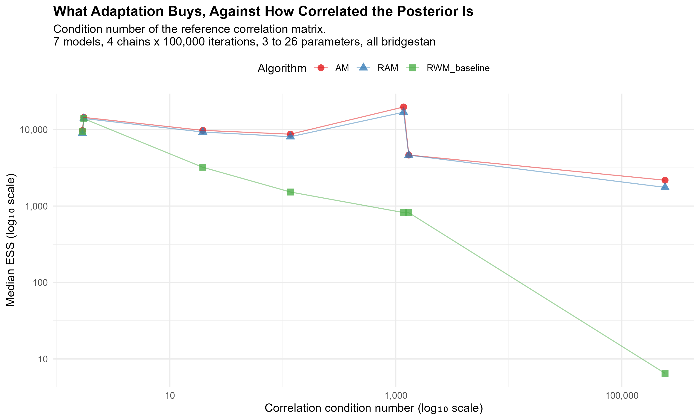
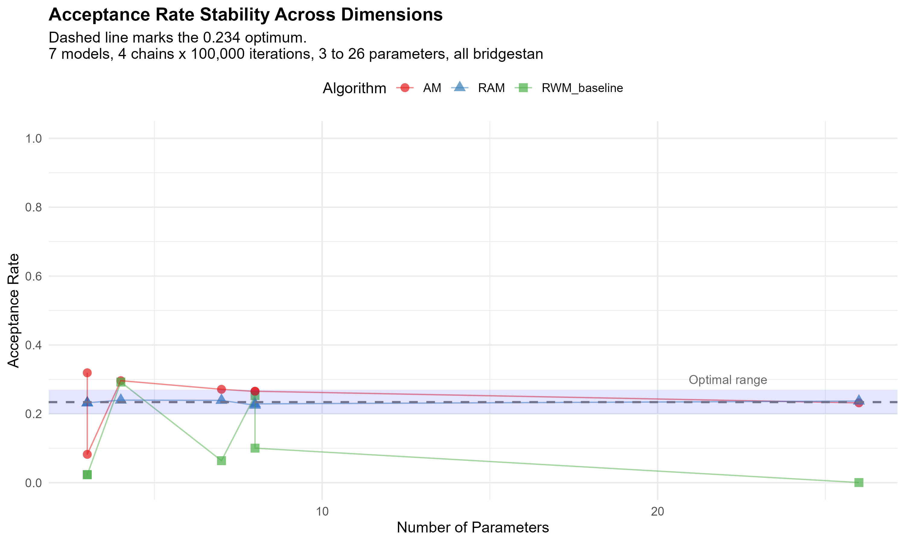
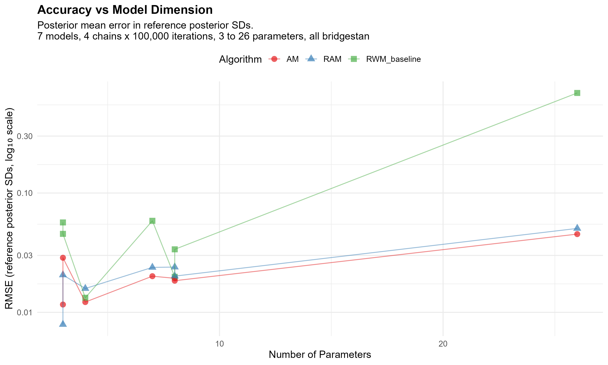

# MyMCMC - Adaptive MCMC from Scratch, Benchmarked on posteriordb

[](https://www.r-project.org/)
[](#the-algorithms)
[](https://github.com/stan-dev/posteriordb)
[](https://github.com/nihadaslanzade-02/MyMCMC/actions/workflows/ci.yml)
[](LICENSE)

Reference R implementations of the classical and adaptive MCMC algorithms from the thesis **"Exploration of Adaptive Algorithms"**, plus an empirical harness that runs them against real Bayesian posteriors from [posteriordb](https://github.com/stan-dev/posteriordb) and measures how they actually behave.

The repository has two halves that are worth judging separately:

1. **The samplers** - Monte Carlo integration, a generic MCMC skeleton, Metropolis-Hastings, Random Walk Metropolis, Hamiltonian Monte Carlo with leapfrog integration, Adaptive Metropolis, and Robust Adaptive Metropolis. Written for readability, in base R, each one documented with its inputs, outputs and the algorithm number it corresponds to in the thesis.
2. **The benchmark** - discovery of which posteriordb models have reference posteriors, dimension extraction, model selection across dimension bands, compiled Stan log densities through BridgeStan, multi-chain timed runs, ESS/R-hat/RMSE metrics, checkpointing, aggregation and figures.

The first benchmark run published here was a pilot, and the [Results](#results) section keeps the account of what was wrong with it, because that is the more useful half of the story: its ESS column was reporting the parameter count, its R-hat was never computed across chains at all, and its non-adaptive baseline was crippled by an undocumented constant. Those are fixed, each pinned by a test that fails against the old implementation, and the numbers below come from a fresh run against the real Stan posteriors.

---

## The algorithms

| File | Algorithm | Thesis | Notes |
|---|---|---|---|
| [`basic_monte_carlo.R`](basic_monte_carlo.R) | Monte Carlo integration | 1.1 | Returns the estimate *and* its standard error, `V·sd(f)/√N` - the error bar is part of the answer, not an afterthought |
| [`generic_mcmc.R`](generic_mcmc.R) | Generic MCMC skeleton | 1.2 | Takes a `transition_kernel` returning `list(state, acceptance_prob)`, so Metropolis, Gibbs and others plug into one loop |
| [`metropolis_hastings.R`](metropolis_hastings.R) | Metropolis-Hastings | 1.3 | Full asymmetric-proposal acceptance ratio, evaluated on the log scale |
| ″ | Random Walk Metropolis | 1.4 | Symmetric proposal collapses the ratio to `π(y) - π(x)`; scales the step by `1/√d` above d = 10 (Roberts et al., 1997) |
| [`hmc_leapfrog.R`](hmc_leapfrog.R) | Hamiltonian Monte Carlo | 1.5 | Leapfrog integrator, momentum negation for reversibility, Hamiltonian tracked per iteration for energy diagnostics |
| [`adaptive_algorithms.R`](adaptive_algorithms.R) | Adaptive Metropolis (AM) | - | Empirical covariance of the chain so far, by Welford's recursion, scaled by the optimal `2.38²/d` |
| ″ | Robust Adaptive Metropolis (RAM) | - | Robbins-Monro scale update `s ← s·exp(γₜ(aₜ - a*))` with `γₜ = 1/t^0.6`, targeting `a* = 0.234` |
| ″ | RWM baseline | - | Non-adaptive control, given the target's marginal scales and nothing else |

### Implementation notes

- **Everything on the log scale.** Acceptance is `log(runif(1)) < log_alpha`, never a ratio of raw densities. With a 26-parameter posterior, `exp()` of a log-density difference underflows long before the algorithm would otherwise fail.
- **Diagnostics built into the samplers.** RWM warns when acceptance drifts outside 0.15-0.50; HMC warns outside 0.6-0.9 *and* when the mean absolute energy change exceeds 1, which is the signal that leapfrog integration has gone unstable. The sampler tells you it is misconfigured instead of quietly returning garbage.
- **Numerical guards where they are actually needed.** `+ diag(1e-6, d)` on every adapted covariance before it is used as a proposal; `solve()` on the mass matrix wrapped so a singular covariance falls back to a diagonal approximation; `-Inf` returned for non-finite parameter vectors so a diverged chain rejects instead of crashing.
- **Base R for the core.** `basic_monte_carlo.R`, `generic_mcmc.R`, `metropolis_hastings.R` and `hmc_leapfrog.R` have no dependencies at all - HMC ships its own Cholesky-based multivariate normal sampler. `adaptive_algorithms.R` uses `MASS::mvrnorm`, and MASS ships with R.
- **Burn-in handled consistently.** `n_iterations` is the total chain length in every sampler, with the leading `burn_in` discarded from it, and a `burn_in >= n_iterations` is rejected instead of silently returning two rows of `NA`. Every sampler returns post-burn-in `samples` *and* the `full_chain`, so adaptation behaviour during burn-in stays inspectable.
- **Adaptation runs during burn-in and freezes before the kept draws.** That is the point of burn-in, and it is also what ESS and R-hat require: they are defined for a fixed transition kernel, so the retained stretch is exactly where adaptation must not still be running. `adapt_start` and `adapt_stop` are arguments, so `adapt_stop = n_iterations` gives back the textbook Haario et al. algorithm that adapts forever and stays ergodic by diminishing adaptation.
- **AM's covariance is recursive, not recomputed.** Welford's update is O(d²) per iteration where `cov(chain[1:t, ])` at every adaptation is O(t·d²), so the old version got more expensive the longer the chain ran. At 26 parameters, 50,000 iterations went from 20.6 s to 6.2 s and the cost became linear in chain length. A test pins the two to floating-point agreement.

---

## The benchmark

### Building the comparison set

[`benchmarking_posteriordb.R`](benchmarking_posteriordb.R) walks the whole posteriordb catalogue over its GitHub connection and works out what is actually usable:

| Stage | Result |
|---|---|
| Posteriors in the database | 147 |
| With reference posteriors (gold-standard draws) | **47** |
| Without | 100 |
| Dimensions successfully extracted | 47, ranging **3 to 66** parameters |
| Banded | 23 low (2-5), 22 medium (6-20), 2 high (20+) |
| Selected for benchmarking | **8** - 3 low, 3 medium, and both high-dimensional models |

The dimension extraction is the part worth pointing at. `model_info()` reports parameter counts that do not survive contact with the actual data, so the script pulls the reference draws, converts them with `posterior::as_draws_matrix()`, strips the sampler metadata columns (`.chain`, `.iteration`, `.draw`) and counts what is left - with a comment in the source saying this is the only reliable source. That is the difference between a benchmark you can trust and one you cannot.

### How the target densities are built

[`stan_targets.R`](stan_targets.R) puts two ways of doing this behind one interface, and every result records which one produced it.

**bridgestan**, the default, fetches the posterior's Stan program from posteriordb, compiles it, and calls its actual log density. All seven benchmarked posteriors build and evaluate this way. That means sampling in the **unconstrained space** Stan transforms to, so draws are mapped back through `param_constrain()` before anything is measured. `bball_drive_event_0-hmm_drive_0` makes the distinction concrete: 8 constrained parameters, 6 unconstrained, because `theta1` and `theta2` are simplexes. Its constrained covariance is exactly rank deficient for the same reason, with a condition number around 10¹⁷ - which is a good illustration of why the geometry matters and why the diagnostics are computed on the constrained scale but the sampling is not.

**The Gaussian surrogate** fits a multivariate normal to the reference draws and samples that. It is the fallback when there is no C++ toolchain, and it is not merely a degraded mode: its ground truth is exact, so RMSE compares against a known closed form rather than one finite sample against another. What it cannot test is non-Gaussian geometry - funnels, multimodality, heavy tails - which is where adaptive methods are supposed to earn their keep.

Requesting `bridgestan` explicitly fails when it is unavailable rather than quietly substituting a Gaussian and letting it be read as the real posterior. Compiled models are cached in `stan_cache/`, so a repeat run needs neither network nor a rebuild.

### What gets measured

3 algorithms × 7 models × 4 chains × 100,000 iterations, half discarded as burn-in. 200,000 retained draws per algorithm per model.

**Per chain**, because they are properties of one chain: **RMSE** and **MAE** of the posterior mean against the reference, both raw and normalised by the reference posterior's per-parameter SD; **acceptance rate**; wall-clock **runtime**.

**Across the four chains together**, because they are not: per-parameter **ESS** (bulk and tail) and **R-hat**, via `posterior::summarise_draws()` on an iterations × chains × parameters array. ESS/second divides the all-chains ESS by the all-chains runtime.

Each chain starts at an independent draw from the reference posterior, and every chain is seeded deterministically from `(model, algorithm, chain)`, so the whole run reproduces exactly.

Chains are wrapped in `tryCatch` so one failure does not take down the sweep, and results are checkpointed every 3 models.

Of the 8 selected models, 7 ran. `mcycle_gp-accel_gp` (66 parameters) is skipped by the `max_dimension = 50` guard.

---

## Results

Seven posteriors, all sampled through their own Stan programs, 200,000 retained draws per algorithm per model. The whole sweep takes about half an hour and reproduces exactly from the seed.

| Algorithm | Mean acceptance | SD | Mean ESS | Worst R-hat | Models unconverged | Mean error (ref SDs) | Worst |
|---|---:|---:|---:|---:|---:|---:|---:|
| **AM** | 0.247 | 0.078 | **9,887** | 1.005 | **0** | **0.022** | 0.045 |
| **RAM** | 0.233 | **0.006** | 9,086 | 1.005 | **0** | 0.023 | 0.051 |
| RWM baseline | 0.108 | 0.118 | 4,238 | **2.400** | 2 | 0.131 | 0.690 |

### What the adaptation buys, and when it buys nothing



The baseline is handed each parameter's marginal standard deviation, so scale is not what it is missing. The only thing it cannot represent is the **correlation** between parameters, and the condition number of the reference posterior's correlation matrix says exactly how much of that there is. That, and not dimension, is what predicts the gap:

| Model | Params | Correlation condition | AM | RAM | Baseline | Baseline / AM |
|---|---:|---:|---:|---:|---:|---:|
| `bball_drive_event_0` | 8 (6 unc.) | 1.7 | 9,709 | 8,984 | 9,378 | 0.97 |
| `arma-arma11` | 4 | 1.7 | 14,439 | 13,978 | 13,898 | 0.96 |
| `bball_drive_event_1` | 8 (6 unc.) | 20 | 9,771 | 9,296 | 3,216 | 0.33 |
| `arK-arK` | 7 | 117 | 8,705 | 8,069 | 1,526 | 0.18 |
| `earnings-earn_height` | 3 | 1,172 | 19,764 | 16,884 | 821 | 0.04 |
| `earnings-log10earn_height` | 3 | 1,302 | 4,646 | 4,635 | 819 | 0.18 |
| `diamonds-diamonds` | 26 | 241,407 | 2,177 | 1,754 | **6.5** | 0.003 |

At a correlation condition number near 1 the three algorithms are indistinguishable, and adaptation is pure overhead. By 10³ the baseline is down an order of magnitude. On `diamonds-diamonds` it does not converge at all: median ESS 6.5 out of 200,000 draws, acceptance 0.000, R-hat 2.400 on all 26 parameters, while both adaptive samplers reach R-hat 1.005.

Dimension does not explain this. `earnings-earn_height` has **3** parameters and a condition number of 1,172; `bball_drive_event_0` has 8 and a condition number of 1.7. The baseline does 24× worse on the smaller one.

### Where the baseline wins

On ESS **per second** the picture inverts on exactly the two well-conditioned models. `arma-arma11`: baseline 1,465 ESS/sec against AM's 430, for the same effective sample size at a sixth of the wall clock, because it never forms a covariance. `bball_drive_event_0`: 59.2 against 51.1.

This is why the algorithm table above is sorted by ESS and not by ESS/second. Averaged across models the baseline leads on ESS/second (255 against AM's 211) while failing to converge on two of them - an algorithm that produces no usable samples can top a per-second ranking by being quick about it. The per-second column is worth reading per model, and the model is what decides it.

### RAM holds its acceptance target; AM does not



RAM lands between **0.225 and 0.240** on all seven models, spanning 3 to 26 parameters and five orders of magnitude of conditioning, against a target of 0.234. Its standard deviation across models is **0.006**, thirteen times tighter than AM's 0.078.

AM has no acceptance target - it applies the `2.38²/d` scaling to whatever empirical covariance it has - and ranges from 0.082 to 0.319. That is not a defect, it is the difference between the two algorithms, and it is what the Robbins-Monro loop in RAM exists to remove.

Both reach the same accuracy, so on this evidence the control loop buys predictability rather than performance: AM's mean error is 0.022 reference SDs against RAM's 0.023, and AM is ahead on ESS on all seven models by 5-15%.

### Why the accuracy column is in reference SDs



`earnings-earn_height` has parameters measured in dollars, with reference standard deviations up to 9,668. Its raw RMSE is 60.1 for AM, 33.1 for RAM and 349.2 for the baseline, while every parameter in `diamonds-diamonds` sits below 0.33 and its raw RMSE is 0.008. Averaging those together reports the dollar model and nothing else, which is what the first run's "61.8 mean RMSE" was.

Divided by each parameter's reference SD first, the same three numbers are 0.012, 0.008 and 0.057, and the aggregate is a statement about all seven models: the adaptive samplers put the posterior mean within about 2% of a reference standard deviation, the baseline within 13%, and in the worst case 69%.

### What the first run got wrong

The pilot published before this one produced no usable diagnostics, and the reasons are worth keeping.

**ESS was reporting the parameter count.** Across every model and algorithm it correlated with dimension at **r = 0.9991** - 3 parameters gave 3.7, 8 gave 8.4, 26 gave 26.4. `posterior::ess_bulk()` reduces its input to a single number; handed a whole draws × parameters matrix, the spread between parameters sitting at different locations swamps the autocorrelation within each one and the estimate collapses onto the parameter count. Running it on four independent, perfectly mixed chains reproduces those numbers almost exactly, which is the proof they said nothing about the samplers.

**R-hat was computed inside the chain loop**, where there is no between-chain term to form, and averaging four such values does not reconstruct it. The diagnostic that detects non-mixing was never computed at all.

**The baseline was crippled by a constant.** Its step size was `(2.38 / sqrt(d)) * 0.1`, the `0.1` documented only as "Add 0.1 multiplier". Per-parameter standard deviations across these posteriors span seven orders of magnitude, from 0.0012 to 9,668, so one absolute step meant near-total rejection on the tightest model and near-total acceptance on the widest. The 0.00005 to 0.998 acceptance range that produced was measuring the constant.

**And the chains all started in the same place.** Initial values were `reference_mean + rnorm(d, 0, 0.1)` whatever the model's scale, so on a posterior with SDs in the thousands four chains began at effectively one point - and R-hat cannot detect non-mixing among chains that were never apart.

Each of those is fixed and pinned by a test that fails against the old implementation. Results now carry a schema marker and [`analyze_results.R`](analyze_results.R) refuses a file without one, so the old numbers cannot be charted by accident.

---

## Scope and next steps

### Done

Each of these is pinned by a test that fails when that fix alone is reverted.

**The diagnostics measure what they are named.** ESS is per parameter and computed across chains, so it no longer returns the dimension. R-hat is formed between chains, so it can detect the non-mixing it exists to detect; fewer than two chains warns rather than returning a number that cannot mean anything.

**The comparison is fair.** The non-adaptive baseline is given each parameter's marginal scale instead of an absolute step size that fitted no model in the set, so a difference against it is attributable to the adaptation rather than to a constant. Accuracy is reported in reference posterior SDs before being averaged across models, so a posterior measured in dollars no longer dominates the aggregate.

**The samplers adapt when adaptation is useful.** Adaptation runs during burn-in and freezes before the retained draws, rather than the reverse. AM's covariance is maintained by Welford's recursion, which is what makes a chain long enough to converge affordable. `n_iterations` means the total chain length in every sampler, and a `burn_in` that would swallow the chain is rejected rather than silently returning `NA` rows.

**The run is reproducible and offline.** Chains are seeded from `(model, algorithm, chain)`; the reference draws come from stage 1's saved output rather than a second trip to GitHub; compiled Stan models are cached. The settings live in the script instead of in a 9 MB binary that nothing read.

**The artefacts match the code that produced them.** Results carry a schema marker and the analysis refuses a file without one. Figure subtitles, model counts and dimension ranges are derived from the data rather than typed by hand - `N_models` was reported as `n() / 4` where the chains had already been averaged, turning 7 models into 1.75. A `geom_smooth(method = "loess")` band through about five points per algorithm has been replaced by the observed points: loess replies *"span too small, fewer data values than degrees of freedom"*, falls back to a pseudoinverse, and one figure's subtitle was leaning on the resulting artefact for a claim.

### Still open

In rough order of how much each would change the conclusions:

1. **HMC is implemented but not benchmarked.** The comparison is AM, RAM and the baseline. Including HMC was previously blocked on not having gradients; BridgeStan supplies them through `log_density_gradient()`, so it is now a matter of choosing a step size and trajectory length policy that makes the comparison fair rather than tuned against untuned.
2. **The seven models are a convenience sample.** Stage 1 takes the first three names in each dimension band, in the order posteriordb lists them, out of 47 candidates. The conditioning result below rests on seven points chosen that way, and it deserves a stratified or random draw over the full set.
3. **`mcycle_gp-accel_gp` is still excluded** by `max_dimension = 50`. At 66 parameters it is the only posterior in the set wide enough to test where a full d × d covariance adaptation stops paying for itself, which is exactly the regime the comparison has least to say about.
4. **The samplers are interpreted R loops.** Every runtime, and therefore every ESS/second, carries that. Those columns rank these three implementations against each other; they are not a comparison against a compiled sampler.
5. **Chains start dispersed like the posterior, not overdispersed relative to it.** R-hat still catches a stuck sampler, since four chains frozen at four different draws have almost no within-chain variance, but this measures mixing from a good start rather than recovery from a bad one.
6. **RAM's shape update is not Vihola's.** The Robbins-Monro scale adaptation is faithful to the paper; the shape adaptation is a windowed empirical covariance standing in for the rank-one Cholesky update, which the source comment says and this repeats because it is easy to miss.

---

## Repository layout

```
MyMCMC/
├── basic_monte_carlo.R              # Alg 1.1 - MC integration with standard error
├── generic_mcmc.R                   # Alg 1.2 - kernel-agnostic MCMC skeleton
├── metropolis_hastings.R            # Alg 1.3 / 1.4 - MH and Random Walk Metropolis
├── hmc_leapfrog.R                   # Alg 1.5 - HMC, leapfrog integrator, energy diagnostics
├── adaptive_algorithms.R            # AM, RAM, and the non-adaptive RWM baseline
│
├── benchmarking_posteriordb.R       # stage 1 - discover, extract dimensions, select
├── stan_targets.R                   # Stan log densities and Gaussian surrogates, one interface
├── run_benchmarking.R               # stage 2 - build targets, run chains
├── benchmark_metrics.R              # accuracy per chain, convergence across chains
├── analyze_results.R                # stage 3 - aggregate, tabulate, plot
│
├── tests/                           # 44 tests, base-R runner, no framework needed
│
├── posteriordb_discovery.rds        # 47 posteriors with references, with dimensions
├── benchmark_config.rds             # selected models + reference draws (9.4 MB, regenerable)
├── benchmark_results.rds            # the run behind the figures below
├── benchmark_summary_*.csv          # aggregated tables
├── benchmark_best_per_model.csv
│
├── figures/                         # 5 figures, PDF + PNG at 300 dpi
├── stan_cache/                      # compiled Stan models (gitignored, rebuilt on demand)
├── .github/workflows/ci.yml         # parse every script, run the suite on R 4.3 / 4.4 / release
└── LICENSE
```

---

## Tests

```bash
Rscript tests/run_tests.R
```

44 tests, about a minute, no network and no benchmark data. The runner is
roughly 100 lines of base R providing `test_that`, the `expect_*` calls and a
`skip_if`, because the samplers deliberately depend on nothing beyond base R
and MASS and the suite keeps that property: its only package is `posterior`,
which the diagnostics under test already require.

Three groups are worth reading.

- **The convergence tests** build chains whose correct answers are known by
  construction - independent draws for the healthy case, chains stuck in
  separate places for the unhealthy one - so a failure means the diagnostic is
  wrong rather than that an expected value was copied from a previous run.
- **The target tests** check the Gaussian surrogate's log density against the
  multivariate normal formula written out independently, and round trip a
  parameter vector through Stan's unconstraining transform and back.
- **The sweep tests** run the whole of stage 2 on two synthetic posteriors,
  including that the same seed reproduces a run exactly and a different one
  does not.

One test needs a C++ toolchain and the BridgeStan sources and skips with its
reason printed when they are absent, which is the case in CI. CI runs the
suite on R 4.3, 4.4 and release, and parses every script first, since the
benchmark stages cannot run there.

---

## Reproducing

**Requirements.** R 4.0+. The samplers need nothing beyond base R and MASS. The benchmark additionally needs `posteriordb`, `posterior`, `dplyr`, `ggplot2`, `tidyr`, `knitr` and `jsonlite`, plus network access for stage 1, which pulls the reference posteriors from GitHub.

Sampling the real Stan posteriors also needs `bridgestan`, a C++ toolchain, and the BridgeStan sources:

```r
install.packages("bridgestan")
bridgestan:::get_bridgestan_path(download = TRUE)   # ~200 MB, Stan included
```

On Windows the toolchain is Rtools, and its `usr/bin` and `x86_64-w64-mingw32.static.posix/bin` have to be on `PATH` before R starts - `make` is not there by default. `stan_targets.R` reports which of these is missing rather than failing obscurely, and `run_benchmarking.R` falls back to the Gaussian surrogate with a note when any of it is absent, so the benchmark runs either way. The first Stan model compiled takes about three minutes because it builds the Stan library; after that each model is roughly 25 seconds, and re-runs load the cached shared library in under two.

Using a sampler on its own - no benchmark infrastructure required:

```r
source("metropolis_hastings.R")

target_log_density <- function(x) -0.5 * sum(x^2)   # standard normal, up to a constant

fit <- random_walk_metropolis(
  target_log_density = target_log_density,
  proposal_sd        = 2.38,
  initial_value      = c(0, 0),
  n_iterations       = 10000,   # total chain length, burn_in included
  burn_in            = 1000
)

fit$acceptance_rate
colMeans(fit$samples)           # 9000 draws
```

`n_iterations` is the whole chain in every sampler here, with the leading `burn_in` discarded from it. The two families used to disagree about this; see the note at the top of [`adaptive_algorithms.R`](adaptive_algorithms.R).

Comparing the adaptive samplers on a target of your own:

```r
source("adaptive_algorithms.R")

for (algo in list(AM = adaptive_metropolis, RAM = robust_adaptive_metropolis)) {
  fit <- algo(target_log_density, initial_value = rep(0, 5), n_iterations = 10000)
  cat(fit$acceptance_rate, "\n")
}
```

The full benchmark, in order - stage 1 takes some minutes, since it checks all 147 posteriors for reference draws:

```r
source("benchmarking_posteriordb.R")   # -> posteriordb_discovery.rds, benchmark_config.rds
source("run_benchmarking.R")           # -> benchmark_results.rds
source("analyze_results.R")            # -> summary CSVs and figures/
```

---

## References

- Metropolis, N. et al. (1953). *Equation of state calculations by fast computing machines.* Journal of Chemical Physics, 21(6), 1087-1092.
- Hastings, W. K. (1970). *Monte Carlo sampling methods using Markov chains and their applications.* Biometrika, 57(1), 97-109.
- Roberts, G. O., Gelman, A. & Gilks, W. R. (1997). *Weak convergence and optimal scaling of random walk Metropolis algorithms.* Annals of Applied Probability, 7(1), 110-120. - the 0.234 target acceptance rate
- Haario, H., Saksman, E. & Tamminen, J. (2001). *An adaptive Metropolis algorithm.* Bernoulli, 7(2), 223-242. - AM
- Vihola, M. (2012). *Robust adaptive Metropolis algorithm with coerced acceptance rate.* Statistics and Computing, 22(5), 997-1008. - RAM
- Neal, R. M. (2011). *MCMC using Hamiltonian dynamics.* In: Handbook of Markov Chain Monte Carlo, Chapman & Hall/CRC, 113-162. - HMC and the leapfrog integrator
- Vehtari, A. et al. (2021). *Rank-normalization, folding, and localization: an improved R̂ for assessing convergence of MCMC.* Bayesian Analysis, 16(2), 667-718. - the R-hat and ESS diagnostics used here
- Magnusson, M. et al. *posteriordb: a set of posteriors for Bayesian inference and probabilistic programming.* - [stan-dev/posteriordb](https://github.com/stan-dev/posteriordb)

## License

[MIT](LICENSE).

## Contact

Nihad Aslanzade - [github.com/nihadaslanzade-02](https://github.com/nihadaslanzade-02)
