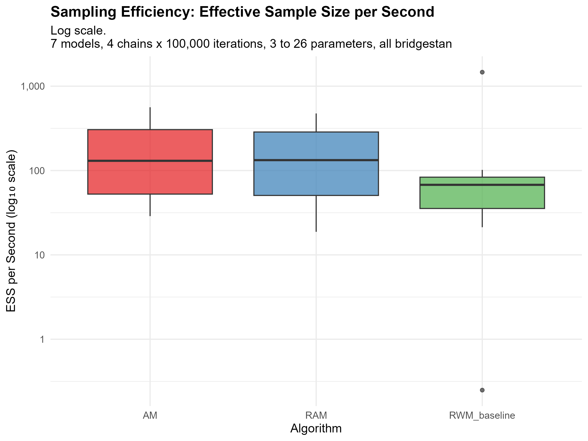

# MyMCMC - Adaptive MCMC from Scratch, Benchmarked on posteriordb

[](https://www.r-project.org/)
[](#the-algorithms)
[](https://github.com/stan-dev/posteriordb)
[](LICENSE)

Reference R implementations of the classical and adaptive MCMC algorithms from the thesis **"Exploration of Adaptive Algorithms"**, plus an empirical harness that runs them against real Bayesian posteriors from [posteriordb](https://github.com/stan-dev/posteriordb) and measures how they actually behave.

The repository has two halves that are worth judging separately:

1. **The samplers** - Monte Carlo integration, a generic MCMC skeleton, Metropolis-Hastings, Random Walk Metropolis, Hamiltonian Monte Carlo with leapfrog integration, Adaptive Metropolis, and Robust Adaptive Metropolis. Written for readability, in base R, each one documented with its inputs, outputs and the algorithm number it corresponds to in the thesis.
2. **The benchmark** - discovery of which posteriordb models have reference posteriors, dimension extraction, model selection across dimension bands, multi-chain timed runs, ESS/R-hat/RMSE metrics, checkpointing, aggregation and figures.

The benchmark run committed here is a **pilot**: the harness completes end to end, and it produces one clean result about acceptance-rate control. Its convergence diagnostics do not pass, and the [Results](#results) section says exactly which numbers can and cannot be read as findings. That distinction is the point of publishing it.

---

## The algorithms

| File | Algorithm | Thesis | Notes |
|---|---|---|---|
| [`basic_monte_carlo.R`](basic_monte_carlo.R) | Monte Carlo integration | 1.1 | Returns the estimate *and* its standard error, `V·sd(f)/√N` - the error bar is part of the answer, not an afterthought |
| [`generic_mcmc.R`](generic_mcmc.R) | Generic MCMC skeleton | 1.2 | Takes a `transition_kernel` returning `list(state, acceptance_prob)`, so Metropolis, Gibbs and others plug into one loop |
| [`metropolis_hastings.R`](metropolis_hastings.R) | Metropolis-Hastings | 1.3 | Full asymmetric-proposal acceptance ratio, evaluated on the log scale |
| ″ | Random Walk Metropolis | 1.4 | Symmetric proposal collapses the ratio to `π(y) - π(x)`; scales the step by `1/√d` above d = 10 (Roberts et al., 1997) |
| [`hmc_leapfrog.R`](hmc_leapfrog.R) | Hamiltonian Monte Carlo | 1.5 | Leapfrog integrator, momentum negation for reversibility, Hamiltonian tracked per iteration for energy diagnostics |
| [`adaptive_algorithms.R`](adaptive_algorithms.R) | Adaptive Metropolis (AM) | - | Empirical covariance of the chain so far, scaled by the optimal `2.38²/d` |
| ″ | Robust Adaptive Metropolis (RAM) | - | Robbins-Monro scale update `s ← s·exp(γₜ(aₜ - a*))` with `γₜ = 1/t^0.6`, targeting `a* = 0.234` |
| ″ | RWM baseline | - | Non-adaptive control condition for the comparison |

### Implementation notes

- **Everything on the log scale.** Acceptance is `log(runif(1)) < log_alpha`, never a ratio of raw densities. With a 26-parameter posterior, `exp()` of a log-density difference underflows long before the algorithm would otherwise fail.
- **Diagnostics built into the samplers.** RWM warns when acceptance drifts outside 0.15-0.50; HMC warns outside 0.6-0.9 *and* when the mean absolute energy change exceeds 1, which is the signal that leapfrog integration has gone unstable. The sampler tells you it is misconfigured instead of quietly returning garbage.
- **Numerical guards where they are actually needed.** `+ diag(1e-6, d)` on every adapted covariance before it is used as a proposal; `solve()` on the mass matrix wrapped so a singular covariance falls back to a diagonal approximation; `-Inf` returned for non-finite parameter vectors so a diverged chain rejects instead of crashing.
- **Base R for the core.** `basic_monte_carlo.R`, `generic_mcmc.R`, `metropolis_hastings.R` and `hmc_leapfrog.R` have no dependencies at all - HMC ships its own Cholesky-based multivariate normal sampler. `adaptive_algorithms.R` uses `MASS::mvrnorm`, and MASS ships with R.
- **Burn-in handled consistently.** Every sampler returns post-burn-in `samples` *and* the `full_chain`, so adaptation behaviour during burn-in stays inspectable.

---

## The benchmark

### Building the comparison set

[`benchamrking_posteriordb.R`](benchamrking_posteriordb.R) walks the whole posteriordb catalogue over its GitHub connection and works out what is actually usable:

| Stage | Result |
|---|---|
| Posteriors in the database | 147 |
| With reference posteriors (gold-standard draws) | **47** |
| Without | 100 |
| Dimensions successfully extracted | 47, ranging **3 to 66** parameters |
| Banded | 23 low (2-5), 22 medium (6-20), 2 high (20+) |
| Selected for benchmarking | **8** - 3 low, 3 medium, and both high-dimensional models |

The dimension extraction is the part worth pointing at. `model_info()` reports parameter counts that do not survive contact with the actual data, so the script pulls the reference draws, converts them with `posterior::as_draws_matrix()`, strips the sampler metadata columns (`.chain`, `.iteration`, `.draw`) and counts what is left - with a comment in the source saying this is the only reliable source. That is the difference between a benchmark you can trust and one you cannot.

### How the target densities are built

[`run_benchmarking.R`](run_benchmarking.R) does **not** evaluate the Stan model log density. For each posterior it loads the reference draws, computes their mean and covariance, and builds a multivariate normal with those moments as the sampling target.

This is a deliberate trade and worth understanding before reading any number below:

- **What it buys.** The ground truth is exact. The target's true mean and covariance are known in closed form, so RMSE is an exact accuracy measure rather than a comparison against another finite sample. Dimension and correlation structure still come from real posteriors.
- **What it costs.** Nothing here tests the samplers against non-Gaussian geometry - funnels, multimodality, heavy tails - which is precisely where adaptive methods are supposed to earn their keep. `bridgestan` is imported at the top of the script but never called; wiring it in is what would turn this into a benchmark on true posteriors.

### What gets measured

3 algorithms × 8 models × 4 chains × 10,000 iterations, half discarded as burn-in. Per chain: **ESS** (`posterior::ess_bulk`), **R-hat**, **RMSE** and **MAE** of the posterior mean against the reference, **acceptance rate**, and wall-clock **runtime** - with ESS/second as the efficiency measure. Chains are wrapped in `tryCatch` so one failure does not take down the sweep, and results are checkpointed to disk every 3 models.

Of the 8 selected models, 7 completed. `mcycle_gp-accel_gp` (66 parameters) was skipped by the `max_dimension = 50` guard.

---

## Results

### The clear finding: RAM's scale adaptation holds its target, the others do not


| Algorithm | Mean acceptance | SD | Range across models |
|---|---:|---:|---|
| **RAM** | 0.243 | **0.013** | 0.222 - 0.258 |
| AM | 0.213 | 0.227 | 0.004 - 0.606 |
| RWM baseline | 0.167 | 0.407 | 0.00005 - 0.998 |

RAM lands between 0.222 and 0.258 on every single model, across dimensions 3 through 8 - within 0.025 of the theoretical optimum of **0.234**, with a spread **18× tighter than AM's and 32× tighter than the baseline's**. AM and RWM swing between a chain that accepts almost everything and a chain that accepts essentially nothing.

This one is safe to read as a result, because it is a property of the control loop itself rather than of the samples it produced: RAM's Robbins-Monro update is driving acceptance to its target and demonstrably succeeding, which is exactly what it is designed to do. Nothing about chain convergence is required for that claim to hold.

### Reading the rest critically

Everything else in the committed run is measurement, not finding. The diagnostics say so plainly:

| Diagnostic | Observed | Healthy |
|---|---|---|
| ESS (median, per chain) | **3.4 - 9.2** out of 5,000 post-burn-in draws | hundreds to thousands |
| R-hat (max) | **2.38 - 4.95**, and `Inf` for RWM on two models | < 1.01 |

Three things follow, and none of them are the headline the summary table appears to offer:

1. **The ESS/second ranking is a timing artefact.** RWM comes top at 64.9 ESS/sec against RAM's 10.3 - but RWM has the *lowest* raw ESS of the three (5.93 vs 6.36 and 6.23). It wins only because it runs in 0.09 s against 0.61-0.67 s, since it skips covariance adaptation entirely. Dividing a near-identical numerator by a 7× smaller denominator is not an efficiency result. And on five of the six models RWM's acceptance rate is under 0.3%, meaning the chain it timed so favourably was barely moving.
2. **No chain converged, so no accuracy comparison stands.** R-hat above 2 means the chains have not mixed; the RMSE column cannot separate the algorithms while that is true.
3. **Mean RMSE across models is not a meaningful aggregate.** RMSE is never scale-normalised, and `earnings-earn_height` is on a raw dollar scale where RMSE reaches 185-370 while every other model sits below 0.5. The 61.8 mean RMSE reported for RAM is essentially that one model.

There is also a strong hint of a metric bug worth chasing: ESS tracks the parameter count closely - 3 parameters gives ESS ≈ 3.6, 4 gives ≈ 4.9, 7 gives ≈ 7.9, 8 gives ≈ 8.5 - across every model and every algorithm. A genuine effective sample size has no reason to equal the dimension. `ess_bulk()` is most likely being handed a multi-parameter `draws_matrix` where it expects a single variable.




---

## Scope and next steps

In rough order of how much each would change the conclusions:

1. **Fix the ESS computation** and re-run. Until effective sample size is per-parameter and believable, no efficiency claim is safe.
2. **Compute R-hat across the 4 chains, not within each one.** [`run_benchmarking.R`](run_benchmarking.R) calls `compute_metrics()` per chain and averages, so the multi-chain diagnostic - the one that actually detects non-mixing - is never computed. The chains are already being run; only the aggregation needs changing.
3. **Point the analysis at the completed results.** [`analyze_results.R`](analyze_results.R) reads `benchmark_results_partial.rds` (6 models) rather than `benchmark_results.rds` (7). `diamonds-diamonds`, at 26 parameters the only high-dimensional model that ran, is missing from every figure and CSV - which is why the figures announce 7 models and a 3-26 parameter range while plotting 6 models topping out at 8. One-line change, and it restores the entire high-dimension end of the comparison.
4. **Give the chains room.** 10,000 iterations for an adaptive sampler that only begins adapting after burn-in is thin; RAM's shape update fires every 50 iterations on a 500-iteration window.
5. **Normalise RMSE** per model - by reference posterior SD - before averaging across models.
6. **Wire in `bridgestan`** to sample the true posteriors instead of Gaussian surrogates. This is the one that makes the benchmark a statement about adaptive MCMC rather than about adaptive MCMC on Gaussian targets.

---

## Repository layout

```
MyMCMC/
├── basic_monte_carlo.R              # Alg 1.1 - MC integration with standard error
├── generic_mcmc.R                   # Alg 1.2 - kernel-agnostic MCMC skeleton
├── metropolis_hastings.R            # Alg 1.3 / 1.4 - MH and Random Walk Metropolis
├── hmc_leapfrog.R                   # Alg 1.5 - HMC, leapfrog integrator, energy diagnostics
├── adaptive_algorithms.R            # AM, RAM, and the non-adaptive RWM baseline
│
├── benchamrking_posteriordb.R       # stage 1 - discover, extract dimensions, select, configure
├── run_benchmarking.R               # stage 2 - build targets, run chains, compute metrics
├── analyze_results.R                # stage 3 - aggregate, tabulate, plot
│
├── posteriordb_discovery.rds        # 47 posteriors with references, with dimensions
├── benchmark_config.rds             # selected models + reference draws (9.4 MB, regenerable)
├── benchmark_results.rds            # 7 models complete
├── benchmark_results_partial.rds    # 6-model checkpoint (what analyze_results.R reads)
├── benchmark_summary_*.csv          # aggregated tables
├── benchmark_best_per_model.csv
│
├── figures/                         # 4 figures, PDF + PNG at 300 dpi
└── LICENSE
```

---

## Reproducing

**Requirements.** R 4.0+. The samplers need nothing beyond base R and MASS. The benchmark additionally needs `posteriordb`, `posterior`, `dplyr`, `ggplot2`, `tidyr`, `knitr`, `jsonlite` and network access - stage 1 pulls reference posteriors from GitHub.

Using a sampler on its own - no benchmark infrastructure required:

```r
source("metropolis_hastings.R")

target_log_density <- function(x) -0.5 * sum(x^2)   # standard normal, up to a constant

fit <- random_walk_metropolis(
  target_log_density = target_log_density,
  proposal_sd        = 2.38,
  initial_value      = c(0, 0),
  n_iterations       = 10000,
  burn_in            = 1000
)

fit$acceptance_rate
colMeans(fit$samples)
```

Comparing the adaptive samplers on a target of your own:

```r
source("adaptive_algorithms.R")

for (algo in list(AM = adaptive_metropolis, RAM = robust_adaptive_metropolis)) {
  fit <- algo(target_log_density, initial_value = rep(0, 5), n_iterations = 10000)
  cat(fit$acceptance_rate, "\n")
}
```

The full benchmark, in order - stage 1 takes some minutes, since it checks all 147 posteriors for reference draws:

```r
source("benchamrking_posteriordb.R")   # -> posteriordb_discovery.rds, benchmark_config.rds
source("run_benchmarking.R")           # -> benchmark_results.rds
source("analyze_results.R")            # -> summary CSVs and figures/
```

---

## References

- Metropolis, N. et al. (1953). *Equation of state calculations by fast computing machines.* Journal of Chemical Physics, 21(6), 1087-1092.
- Hastings, W. K. (1970). *Monte Carlo sampling methods using Markov chains and their applications.* Biometrika, 57(1), 97-109.
- Roberts, G. O., Gelman, A. & Gilks, W. R. (1997). *Weak convergence and optimal scaling of random walk Metropolis algorithms.* Annals of Applied Probability, 7(1), 110-120. - the 0.234 target acceptance rate
- Haario, H., Saksman, E. & Tamminen, J. (2001). *An adaptive Metropolis algorithm.* Bernoulli, 7(2), 223-242. - AM
- Vihola, M. (2012). *Robust adaptive Metropolis algorithm with coerced acceptance rate.* Statistics and Computing, 22(5), 997-1008. - RAM
- Neal, R. M. (2011). *MCMC using Hamiltonian dynamics.* In: Handbook of Markov Chain Monte Carlo, Chapman & Hall/CRC, 113-162. - HMC and the leapfrog integrator
- Vehtari, A. et al. (2021). *Rank-normalization, folding, and localization: an improved R̂ for assessing convergence of MCMC.* Bayesian Analysis, 16(2), 667-718. - the R-hat and ESS diagnostics used here
- Magnusson, M. et al. *posteriordb: a set of posteriors for Bayesian inference and probabilistic programming.* - [stan-dev/posteriordb](https://github.com/stan-dev/posteriordb)

## License

[MIT](LICENSE).

## Contact

Nihad Aslanzade - [github.com/nihadaslanzade-02](https://github.com/nihadaslanzade-02)
